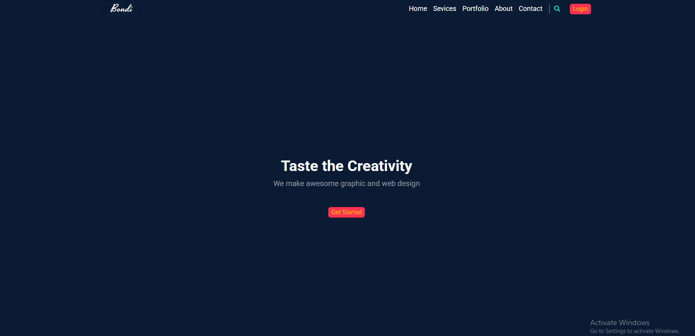

# Bootstrap Bondi Template

A modern and responsive landing page built with **Bootstrap 5**, **HTML5**, and **CSS3**. This project was created as part of my Bootstrap learning journey, focusing on responsive layouts, reusable components, and clean UI design.

## 🚀 Live Demo

[Click Here]()

## 📸 Preview



## ✨ Features

* Fully responsive design
* Modern landing page layout
* Responsive navigation bar
* Features section
* Portfolio (Our Work) section
* Stuff About Us section
* Team section
* Project call-to-action section
* Blog section
* Newsletter subscription form
* Footer with social media links
* Custom CSS variables for easy theme customization
* Font Awesome icons

## 🛠️ Built With

* HTML5
* CSS3
* Bootstrap 5
* Font Awesome

## 📂 Project Structure

```text
├── css/
│   ├── bootstrap/
│   ├── fontawesome/
│   └── bondi.css
├── images/
├── js/
├── index.html
└── README.md
```

## 📥 Getting Started

Clone the repository:

```bash
git clone https://github.com/sherift911/bootstrap-bondi-template.git
```

Open `index.html` in your browser.

## 🎯 Purpose

The purpose of this project is to practice building responsive websites using Bootstrap 5 while improving front-end development skills.

## 📄 License

This project is intended for learning and portfolio purposes.
